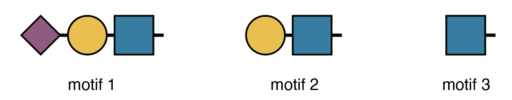

```{r, include = FALSE}
knitr::opts_chunk$set(
  collapse = TRUE,
  comment = "#>"
)
```

This vignette walks you through a complete glycomics analysis using `glycoverse`.
We'll explore the full spectrum of glycomics data analysis,
from data loading and preprocessing to statistical analysis and visualization.
We'll also dive into advanced glycan structure analysis,
including motif quantification and derived trait analysis.
Ready to dive in? Let's go!

**Heads up:** `glycoverse` is built on `tidy` principles throughout.
If you're new to `tidyverse` data analysis,
we highly recommend checking out Hadley Wickham's excellent [R for Data Science](https://r4ds.hadley.nz).
Trust us, it's worth the investment!

Quick readiness check:

- What's a `tibble`?
- How do you filter rows in a `tibble`?
- What's the modern alternative to `for` loops?
- What's the `|>` operator?
- What makes data "tidy"?

## TL;DR

In case you're in a hurry...

```R
# Load the packages
library(tidyverse)
library(glycoverse)
library(SummarizedExperiment)

# Preprocess the data
clean_exp <- auto_clean(real_experiment2)

# Perform PCA
pca_res <- gly_pca(clean_exp)
autoplot(pca_res)

# Perform differential expression analysis
anova_res <- gly_anova(clean_exp)
get_tidy_result(anova_res, "main_test")

# Perform motif analysis
motifs <- c(
  motif1 = "Neu5Ac(??-?)Gal(??-?)GlcNAc(??-",
  motif2 = "Gal(??-?)GlcNAc(??-",
  motif3 = "GlcNAc(??-"
)
motif_exp <- quantify_motifs(clean_exp, motifs)
motif_anova_res <- gly_anova(motif_exp)
get_tidy_result(motif_anova_res, "main_test")

# Perform derived trait analysis
trait_exp <- derive_traits(clean_exp)
trait_anova_res <- gly_anova(trait_exp)
get_tidy_result(trait_anova_res, "main_test")
```

## Loading the Packages

We first load the `tidyverse` package, as usual.

```{r}
library(tidyverse)
```

Just like `tidyverse`, `glycoverse` is a meta-package that loads
a collection of specialized packages all at once.

```{r}
library(glycoverse)
```

The Glycoverse data containers extend `SummarizedExperiment`, so we load it to
use its standard accessors.

```{r}
library(SummarizedExperiment)
```

## Reading the Data

Data import is typically your first step in any analysis.
For this tutorial, we'll use the `real_experiment2` dataset that comes with `glyexp`.
This is a real-world N-glycomics dataset from 144 patients across four liver conditions:
healthy controls (H), hepatitis (M), cirrhosis (Y), and hepatocellular carcinoma (C).

```{r}
real_experiment2
```

For your own glycomics projects, create a `GlycomicSE` object.
See [Get Started with glyexp](https://glycoverse.github.io/glyexp/articles/glyexp.html) for details.

The `real_experiment2` object is a `GlycomicSE` object, a specialized
`SummarizedExperiment` for glycomics data. It manages three key components:

- **Abundance assay**: quantitative data with samples as columns and variables as rows
- **Column data**: sample metadata (group, batch, demographics, etc.)
- **Row data**: feature metadata (glycan compositions, glycan structures, etc.)

You can access these components with `assay()`, `colData()`, and `rowData()`.

```{r}
assay(real_experiment2)[1:5, 1:5]
```

```{r}
as_tibble(colData(real_experiment2))
```

```{r}
as_tibble(rowData(real_experiment2))
```

For a deeper dive into Glycoverse data containers, check out [Get Started with glyexp](https://glycoverse.github.io/glyexp/articles/glyexp.html).

## Data Preprocessing

Raw quantification data needs preprocessing before analysis—that's just a fact of life in omics.
Typical steps include normalization, missing value imputation, and batch effect correction.
Rather than making you implement these tedious steps manually, `glyclean` provides a comprehensive preprocessing pipeline.
Just call `auto_clean()` on your `GlycomicSE` object and you're good to go.

```{r}
clean_exp <- auto_clean(real_experiment2)
```

Your data is now analysis-ready!

Want to customize the preprocessing steps?
See [Get Started with glyclean](https://glycoverse.github.io/glyclean/articles/glyclean.html) for the full toolkit.

## Statistical Analysis and Visualization

Time for the fun part—statistical analysis and visualization!
We'll use `glystats` for the number crunching
and `glyvis` to make sense of the results visually.

Let's kick off with PCA to get a bird's-eye view of our data structure.

```{r}
#| fig-width: 4
#| fig-height: 4
plot_pca(clean_exp)  # from `glyvis`
```

`glyvis` isn't designed for publication-ready figures,
but it's perfect for quick exploratory visualization.
Behind the scenes, `plot_pca()` calls `gly_pca()` from `glystats`
and renders the results.

You can also break this down into separate steps:

```{r}
#| fig-width: 4
#| fig-height: 4
pca_res <- gly_pca(clean_exp)  # from `glystats`
autoplot(pca_res)  # from `glyvis`
# you can also use `plot_pca(pca_res)`
```

We actually recommend the two-step approach,
since it gives you more flexibility with the results.
You can create custom `ggplot2` visualizations for publications
or extract the underlying data when reviewers ask for it.

`glystats` covers virtually all standard omics analyses.
All functions follow the same naming pattern: `gly_xxx()`—think `gly_anova()`, `gly_ttest()`, `gly_roc()`, `gly_cox()`, `gly_wgcna()`, and so on.
They take a `GlycomicSE`, `GlycoproteomicSE`, or compatible `SummarizedExperiment` as their first argument.

The return format is consistent across all functions—a list with two components:

- **`tidy_result`**: cleaned-up tibbles in tidy format.
  We've done the heavy lifting of organizing messy statistical output for you.
- **`raw_result`**: the original statistical objects.
  These are available when you need to dig deeper or perform advanced analyses.

`glystats` provides two helper functions to get the tidy result tibble and the raw result list from a glystats result object:
`get_tidy_result()` and `get_raw_result()`.
Let's now see what the `samples` tibble looks like:

```{r}
get_tidy_result(pca_res, "samples")  # many tibbles, so we specify one of them
```

Notice the "group" column? That's `glystats` being helpful—
it automatically pulls relevant metadata from your `GlycomicSE` object
and includes it in the results wherever it makes sense.

Back to that `autoplot()` magic we saw earlier.
It automatically recognizes different `glystats` result types and plots accordingly—
no manual specification needed.
The plots won't win any beauty contests, but they'll get your data insights across fast.

Now let's dive into differential expression analysis with ANOVA.

```{r}
anova_res <- gly_anova(clean_exp, contrasts = "H_vs_C")  # from `glystats`
get_tidy_result(anova_res, "main_test")  # only one tibble here
```

Excellent! Now let's identify significantly differentially expressed glycans between HCC and healthy samples.

```{r}
anova_res |>
  get_tidy_result("main_test") |>
  filter(p_adj < 0.05) |>
  select(glycan_composition, p_adj, effect_size, post_hoc)
```

For the full statistical arsenal, check out [Get Started with glystats](https://glycoverse.github.io/glystats/articles/glystats.html)
and [Get Started with glyvis](https://glycoverse.github.io/glyvis/articles/glyvis.html).

## Advanced Motif Analysis

Up to now, we've covered standard glycomics workflows.
While `glycoverse` certainly streamlines these analyses,
it truly shines when it comes to advanced glycan structure analysis.

Before diving into motifs, let's get acquainted with `glyrepr::glycan_structure()` vectors.

```{r}
clean_exp |>
  rowData() |>
  as_tibble() |>
  pull(glycan_structure)
```

Just like `integer()` and `character()`, `glycan_structure()` is a specialized vector type.
Some software (like pGlyco3 and StrucGP) outputs structural information as text strings.
When you import this data using `glyread`, the `glyparse` package automatically
converts these strings into proper `glycan_structure()` vectors
and stores them in the variable information tibble.
Note that not all software provides structural data—some only give compositions.

For glycomics data, this information is hard to come by automatically.
You can do it manually by parsing the glycan structure strings using `glyparse`
and using `left_join_var()` to join the parsed structures to the variable information tibble.

Fortunately, our example dataset includes structural information,
opening up a world of advanced analytical possibilities.
Let's explore motif analysis.

**Quick note:** The printed structures use IUPAC-condensed notation,
which we'll also use for defining motifs below.
Don't worry if it looks intimidating—we'll include visual diagrams to help.
That said, if you're planning to do serious structural analysis,
learning IUPAC-condensed notation is worth the investment.
Check out [this guide](https://glycoverse.github.io/glyrepr/articles/iupac.html) to get started—it's easier than it looks!

Human serum N-glycans can have three types of branch terminals (ignoring a1-3 Fuc):

1. A Sialyl-LacNAc motif
2. A LacNAc motif without sialic acids
3. Only a GlcNAc without further elongation



Here's how we express these motifs in IUPAC-condensed notation:

```{r}
motifs <- c(
  motif1 = "Neu5Ac(??-?)Gal(??-?)GlcNAc(??-",
  motif2 = "Gal(??-?)GlcNAc(??-",
  motif3 = "GlcNAc(??-"
)
```

The "??-?" represents unknown linkages—a common limitation in mass spectrometry data.

Here's our research question: **Which branching motif show differential expression across conditions?**
Without `glycoverse`, this would be a nightmare to tackle manually.
Take a moment to imagine the pain of doing this by hand!

Now, the `glycoverse` solution:

```{r}
motif_anova_res <- clean_exp |>
  quantify_motifs(motifs, alignments = "terminal") |>  # quantify these motifs
  gly_anova()  # and perform ANOVA

get_tidy_result(motif_anova_res, "main_test")
```

`quantify_motifs()` transforms your data into a new `SummarizedExperiment`.
Instead of quantification of glycans, you now have motif abundances across samples.
All `glystats` functions work seamlessly with this container—including `gly_anova()`.

Now we can answer our question using standard `tidyverse` operations,
since `motif_anova_res$tidy_result$main_test` is just a regular tibble:

```{r}
motif_anova_res |>
  get_tidy_result("main_test") |>
  filter(p_adj < 0.05)
```

`glymotif` has much more to offer beyond these examples.
Dive deeper with [Get Started with glymotif](https://glycoverse.github.io/glymotif/articles/glymotif.html).

## Derived Trait Analysis

Let's wrap up with derived traits—a clever analytical approach
developed by the N-glycomics community for glycome characterization.
Classic examples include:

- High-mannose glycan proportion
- Core-fucosylation rate within complex glycans
- Average sialylation per galactose residue

`glydet` calculates derived traits in a flash.
Using it couldn't be simpler:

```{r}
trait_exp <- derive_traits(clean_exp)  # from `glydet`
trait_exp
```

That's it!
Just like `quantify_motifs()`, `derive_traits()` creates a new `SummarizedExperiment`,
but now with trait values per sample.

The variable information shows what we're working with:

```{r}
as_tibble(rowData(trait_exp))
```

The "trait" column lists all the derived traits we can analyze.

`glydet` comes with a comprehensive set of built-in traits:

- **`TM`**: Proportion of high-mannose glycans
- **`TH`**: Proportion of hybrid glycans
- **`TC`**: Proportion of complex glycans
- **`MM`**: Average number of mannoses within high-mannose glycans
- **`CA2`**: Proportion of bi-antennary glycans within complex glycans
- **`CA3`**: Proportion of tri-antennary glycans within complex glycans
- **`CA4`**: Proportion of tetra-antennary glycans within complex glycans
- **`TF`**: Proportion of fucosylated glycans
- **`TFc`**: Proportion of core-fucosylated glycans
- **`TFa`**: Proportion of arm-fucosylated glycans
- **`TB`**: Proportion of glycans with bisecting GlcNAc
- **`SG`**: Average degree of sialylation per galactose
- **`GA`**: Average degree of galactosylation per antenna
- **`TS`**: Proportion of sialylated glycans

These represent the most widely used traits in glycomics literature.

Let's identify traits with significantly different values across conditions:

```{r}
trait_exp |>
  gly_anova() |>
  get_tidy_result("main_test") |>
  filter(p_adj < 0.05)
```

Once again, it's just that straightforward.

This just scratches the surface of `glydet`'s capabilities.
The real power lies in defining custom traits tailored to your research questions.
Explore the possibilities in [Get Started with glydet](https://glycoverse.github.io/glydet/articles/glydet.html).

## What's Next?

This vignette has given you a taste of `glycoverse` in action
through a real-world glycomics workflow.
But we've barely scratched the surface!
Now that you've got the basics down,
you're ready to unlock the full potential of each package.

Here's your roadmap to mastering each component:

- **[glyexp](https://glycoverse.github.io/glyexp/articles/glyexp.html)** — Master experiment objects and data manipulation
- **[glyread](https://glycoverse.github.io/glyread/articles/glyread.html)** — Import and organize glycomics data
- **[glyclean](https://glycoverse.github.io/glyclean/articles/glyclean.html)** — Build custom preprocessing pipelines
- **[glystats](https://glycoverse.github.io/glystats/articles/glystats.html)** — Explore the full statistical toolkit
- **[glyvis](https://glycoverse.github.io/glyvis/articles/glyvis.html)** — Create stunning visualizations
- **[glymotif](https://glycoverse.github.io/glymotif/articles/glymotif.html)** — Define and analyze custom motifs
- **[glydet](https://glycoverse.github.io/glydet/articles/glydet.html)** — Create powerful derived traits
- **[glyenzy](https://glycoverse.github.io/glyenzy/articles/glyenzy.html)** — Explore enzyme-substrate relationships (we didn't cover this one, but it's fascinating!)
- **[glyrepr](https://glycoverse.github.io/glyrepr/articles/glyrepr.html)** — Master glycan structure representation
- **[glyparse](https://glycoverse.github.io/glyparse/articles/glyparse.html)** — Parse and convert structural formats
- **[glydraw](https://glycoverse.github.io/glydraw/articles/glydraw.html)** — Draw glycan structures
- **[glydb](https://glycoverse.github.io/glydb/articles/glydb.html)** — Access glycan databases
- **[glyanno](https://glycoverse.github.io/glyanno/articles/glyanno.html)** — Annotate glycan structures
- **[glyfun](https://glycoverse.github.io/glyfun/articles/glyfun.html)** — Perform functional enrichment analysis
- **[glysmith](https://glycoverse.github.io/glysmith/articles/glysmith.html)** — Master the full analytical pipeline

Happy glycan hunting! 🧬
